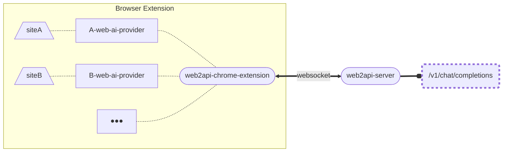

# web2api-ai-sdk-provider

use the AI website you have logged-in to convert the web request to completion API.

## How to use

Video: TODO

1. install the browser extension in the browser.
2. start the server.
3. log in to the AI website.

Test:

```sh
curl -X POST "http://localhost:3000/v1/chat/completions" -H "Content-Type: application/json" -d '{"model":"moonshot","messages":[{"role":"user","content":"give me a random story"}]}'

```

## components

### `<websitename>-web-ai-provider`

include the web request operation as a provider implemented based on the Language Model Specification of `@ai-sdk`

currently supports:

- [moonshot](/packages/moonshot-web-ai-provider/README.md)

```sh
npx jsr add @slow-groovin/moonshot-web-ai-provider
```

`<websitename>-web-ai-provider` can only run in a browser extension environment.

### [`web2api-chrome-extension`](/packages/web2api-chrome-extension/README.md)

The environment where the provider codes execute.
Because it cannot expose a service, a bridge `web2api-server` is needed.

### [`web2api-server`](/packages/web2api-server/README.md)

communicate with `web2api-chrome-extension`, and provide an HTTP service for the openai-compatible API `/v1/chat/completion`.

```sh
npx web2api-server
```

## Note❗❗

1. This project is for personal learning and testing purposes only; please do not use it for commercial purposes.
2. Your account maybe banned by the website.

## structure


