# web2api-ai-sdk-provider

This project includes:

1. serveral providers to convert website chat to [@ai-sdk](https://github.com/vercel/ai) usage.
2. a suite to convert providers to openai-compatible http api.

> [!NOTE]
>
> 1. `<site>-web-ai-provider` can only run in a browser extension environment.
> 2. This project is not a crawler, and there is no anti-crawler mechanism.
> 3. This project is built for personal learning and testing purposes. Please DO NOT use it for commercial purpose. The author is not responsible for the usage of this repository nor endorses it.
> 4. Your account maybe banned if you violate the service provider's user agreement.

## 🛠 How to use

Video: TODO

1. Manually install the `web2api-chrome-extension` in the browser.
2. start the server.
3. log in to the AI website.

Test:

```sh
curl -X POST "http://localhost:3000/v1/chat/completions" -H "Content-Type: application/json" -d '{"model":"moonshot","messages":[{"role":"user","content":"give me a random story"}]}'

```

## components

### `<site>-web-ai-provider`

include the web request operation as a provider implemented based on the Language Model Specification of `@ai-sdk`

currently supports:

- moonshot: [moonshot-web-ai-provider](/packages/moonshot-web-ai-provider/README.md)
- chatgpt: [chatgpt-web-ai-provider](/packages/chatgpt-web-ai-provider/README.md)

install:

```sh
npx jsr add @slow-groovin/moonshot-web-ai-provider

npx jsr add @slow-groovin/chatgpt-web-ai-provider
```

### `web2api-chrome-extension`

[`web2api-chrome-extension` README](/packages/web2api-chrome-extension/README.md)
communicate with `web2api-server`.

### `web2api-server`

[`web2api-server` README](/packages/web2api-server/README.md)
communicate with `web2api-chrome-extension`, and provide an HTTP service for the openai-compatible API `/v1/chat/completion`.

run:

```sh
npx web2api-server
```

## structure

```mermaid
flowchart LR
 subgraph Extension["Browser Extension"]
        webA["siteA"]
        webB["siteB"]
        provider-A["A-web-ai-provider"]
        provider-B["B-web-ai-provider"]
        provider-C["●●●"]
        web2api-chrome-extension(["web2api-chrome-extension"])
  end
    webA -.- provider-A
    provider-A -.- web2api-chrome-extension
    webB -.- provider-B
    provider-B -.- web2api-chrome-extension
    provider-C -.- web2api-chrome-extension
    web2api-chrome-extension <== websocket ==> web2api-server(["web2api-server"])
    web2api-server ==o API["/v1/chat/completions"]

    webA@{ shape: trap-b}
    webB@{ shape: trap-b}
    API@{ shape: rounded}
    style API stroke-width:4px,stroke-dasharray: 5

```


